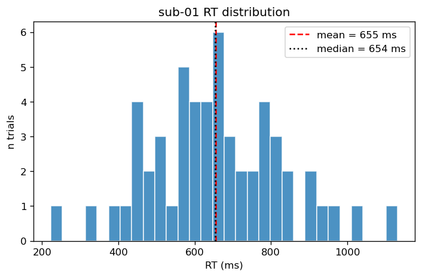
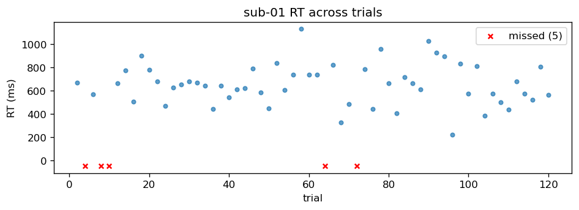

# RT-Analyses-Demo

[](https://github.com/dzweben/RT-Analyses-Demo/actions/workflows/tests.yml)
[](#)
[](LICENSE)

Extracting reaction times from fMRI task event logs — Presentation `.log` files and BIDS `events.tsv` files. Synthetic example data so you can run the whole thing without any real participant files.

The point: every task encodes RTs slightly differently, but the pattern is always the same — find the event that opens the response window, find the next valid response, take the time difference. This repo shows how, with tests.

## Install

```bash
git clone https://github.com/dzweben/RT-Analyses-Demo.git
cd RT-Analyses-Demo
pip install -e ".[dev]"
```

## Use

CLI:

```bash
# extract RTs from one or more Presentation .log files
rt-demo extract examples/synthetic_data/sub-01_task-demo_run-1.log --summary

# generate your own fake log to play with
rt-demo synth my_subject.log --n-trials 80 --miss-rate 0.05
```

Library:

```python
from rt_demo.parsers.presentation import parse_log
from rt_demo.extract import extract_rts
from rt_demo.summary import summarize

log = parse_log('examples/synthetic_data/sub-01_task-demo_run-1.log')
rts = extract_rts(log)               # per-trial RTs
summarize(rts)                       # mean / median / SD / n
```

For BIDS `events.tsv` the API is parallel:

```python
from rt_demo.parsers.bids import parse_events, extract_rts_from_events
events = parse_events('examples/synthetic_data/sub-01_task-demo_events.tsv')
extract_rts_from_events(events)
```

## Example output

`sub-01` synthetic log, 60 trials, 5% miss rate target:

|  |  |
|---|---|

## What's in here

```
RT-Analyses-Demo/
├── rt_demo/
│   ├── parsers/
│   │   ├── presentation.py   # NBS Presentation .log
│   │   └── bids.py           # BIDS events.tsv
│   ├── extract.py            # probe-Picture → first valid Response
│   ├── summary.py            # per-group stats
│   ├── plots.py              # histogram + per-trial scatter
│   ├── synth.py              # synthetic log generator
│   └── cli.py                # rt-demo extract / synth
├── examples/
│   ├── synthetic_data/       # generated demo .log + .tsv
│   ├── plots/                # rendered example figures
│   └── 01_walkthrough.ipynb  # full notebook tour
├── tests/                    # pytest suite (parsers, extract, summary, BIDS)
└── .github/workflows/        # CI: pytest on push (py3.10/3.11/3.12)
```

## Notebook walkthrough

`examples/01_walkthrough.ipynb` runs through parse → extract → summarize → plot → BIDS variant in 5-6 cells.

## License

MIT.
